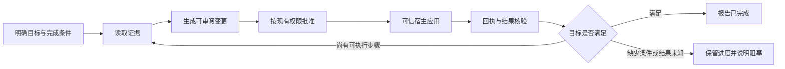

# Muyu Agent 可用性与优化评审

> 历史评审，基于2026-09-29旧代码；能力数量、未实现描述和优先级不代表当前状态。保留未实施设计思路，当前状态见[总表](MUYU-AGENT-STATUS.md)，当前工作顺序见[优化工作单](MUYU-AGENT-OPTIMIZATION.md)。

日期：2026-09-29

代码基线：`b3c3268`，审阅时生产文件无工作区修改。
范围：统一助手的任务理解、观察、工具使用、执行、验证、恢复、上下文与交互。

## 1. 结论

**Muyu 已具备有边界的配置助手基础；复杂任务的主要短板是任务闭环、诊断证据和模型实际执行能力的验证。**

目前比较适合：解释已支持配置、读取已授权资料、生成配置/变量定义草稿、在可信宿主中批准应用。要稳定承担“查明原因—处理问题—确认有效—继续剩余工作”，还有几处结构性缺口。

最该优先投入的三个方向：

1. **把审批、写入、回执和结果核验接回同一个任务。** 用户不应靠再发一句“继续”来推进收尾。
2. **为高频问题提供足够的诊断证据。** 先确保模型有条件答对“为什么”，再优化它的措辞。
3. **建立真实模型的任务验收集。** 判断最终环境是否符合用户目标，并统计用户需要纠正、催促或接管多少次。

已有的工具循环、权限检查、候选产物、基线校验、精确差异审批、部分成功回执、历史回读都值得保留。后续应在这些基础上补任务编排，避免同时重写模型、权限和动作层。

### 证据边界

- **代码确认**：以下关于调用顺序、可读字段、原生写入范围、预算与状态结构的判断来自当前实现。
- **离线确认**：本次使用真实 controller、工具模块与适配器，配合脚本模型、合成资料和内存写入做了三组探针及请求计量；未访问真实模型或用户聊天。
- **待实测**：选错工具、过早停止、用户接管频率及延迟等，属于有机制依据的风险；本次没有测得真实成功率。
- 上次完整回归的 1236 通过、1 跳过属于历史验证结果，本次没有重跑完整测试，也不以此证明 Agent 好用。

优先级 P0/P1/P2 表示产品开发顺序，不是漏洞等级。

## 2. 先看用户能交给它什么任务

| 用户任务 | 当前能力判断 | 主要限制 / 验收重点 |
| --- | --- | --- |
| “topN 是什么？会影响哪些聊天？” | 适合当前范围 | 应查字段合同，说明作用域；无需读取聊天正文 |
| “把 topN 改成 2，并确认改好了” | 能预览和应用，自动收尾不足 | 应用后没有自动启动任务核验；已有手动配置核对可复用 |
| “自动记忆为什么没有运行？” | 能判断部分当前条件 | 当前开关、间隔与成员状态不能证明上次真实失败原因 |
| “为什么 Alice 上一轮没发言？” | 可组合诊断、角色和导演账本资料 | inspect 本身只读匿名状态；账本是可编辑计划，不能直接当作执行证明 |
| “金币为什么不自动更新？” | 原生变量读取证据不足 | 能读存储值；直接读取接口不返回 autoUpdate、rule、updateMode 等 |
| “创建一个自动维护的数值金币变量，顺便调整普通设置” | 已有可用的受限路径 | 当前聊天数值变量定义 + 普通设置可用整单草稿；需验证规则语义和实际保存结果 |
| “把已有金币当前值改为 80” | 原生变量草稿工具不支持该操作 | update 只更新定义字段，不能把 initialValue 当成现值修改接口 |
| “每个角色好感加 5，并修改剧情蓝图” | 超出当前原生业务写入范围 | 不应承诺整件事情可执行；已注册 Provider 的代码执行是另一种有条件能力 |
| “按刚才方案继续，但不要改全局设置” | 依赖对话理解，任务结构支持较弱 | 普通续问通常创建新 task；原目标、已做步骤和最新限制缺少统一状态维护 |
| “大段资料聊完后继续执行未完成部分” | 已有摘要和历史回读基础 | 渐进摘要和运行中工具轨迹压缩仍不完整 |

这里的“超出范围”可以被良好处理：准确说明能力边界、完成可独立完成的部分、给出具体手动入口。它不应被包装成已完成，也不应因一次合理拒绝就判定整个 Agent 失败。

## 3. 优化项

### A. P0：建立动作完成后的任务闭环

**当前证据**

- [controller.js](muyu/application/controller.js) 第 52–75 行：动作变化捕获回执、更新 UI、继续清理自动动作队列；没有进入新的模型观察与核验阶段。
- 同文件第 327–340 行：只有 run 成功结束后才发布产物、安排自动应用。
- 同文件第 611–614 行：新发送时才把最近回执准备给后续请求。
- [config-check.js](muyu/application/config-check.js) 已提供确定性的配置回读核对，但尚未成为普通修改任务的自动完成条件。

本次离线场景“topN 改成 2，并确认修改结果”：预览 → 模型回答 → 宿主写入成功；收到 `applied_confirmed` 回执，模型请求共 2 次，没有第 3 次核验续接。检查过程中也没有自动触发已有的配置核对入口。

**用户影响**

“准备好了”的回答、审批卡、保存结果和最终结论分散在不同阶段。出现部分应用、应用失败或后续依赖步骤时，系统缺少统一的任务推进者。模型即使遵守“不提前说保存成功”，用户仍可能需要主动催促。

**建议实现**

增加轻量任务编排层，复用现有 action coordinator 与 writer：



- 宿主把 `action.completed`、确定性核验结果关联到原 task；普通审批和全权限自动应用走同一条收尾路径。
- 简单字段修改可直接用确定性回读 + 模板结论结束，无需强制增加一次 LLM 调用。
- 存在后续依赖、部分成功或需解释的差异时，才携带回执和剩余目标续接模型。
- 完成状态分别表达：草稿待审阅、应用中、部分完成、当前值已核对、持久化未确认、目标已满足。用户意图决定哪些证据是必要条件。
- 写入结果未知时，优先只读核对。现有回执不应被重新解释成可盲目重试的指令。
- 续接仍检查聊天归属、连接、用户停止/拒绝、权限与总预算；旧产物不能因为恢复任务就自动获得新写入授权。

**验收**

用户只需完成必要审批，不再输入“继续”：一项配置应用后自动核对当前值；整单部分失败时列出已完成/未开始项，后续只处理有明确条件的剩余工作；未确认的持久化保持未确认。

### B. P0：补齐面向问题的观察能力

**当前证据**

- [story-sources.js](muyu/host/story-sources.js) 第 22–52 行：变量投影返回 id、label、type、scope 和存储值，没有更新规则、开关、上下限等。
- [variables/index.js](muyu/modules/variables/index.js) 第 17 行明确：update 只更新定义，不能更新存储值。[variable-draft.js](muyu/host/variable-draft.js) 还限定已有定义为当前聊天 global 数值类型。
- [memory/diagnose.js](muyu/modules/memory/diagnose.js) 明确缺少历史执行记录、连接状态和保存结果。
- [director/index.js](muyu/modules/director/index.js) 区分当前条件和历史原因；[extended-sources.js](muyu/host/extended-sources.js) 已可读取导演账本，但明确其为可编辑计划。

离线构造“金币值 50、autoUpdate=false、有规则”的变量，原生变量读取只返回 50，没有返回足以指出开关关闭的字段。这里缺的是观察信息，换提示词不能补出真实证据。

**建议实现**

1. 提供任务导向的只读诊断入口，例如 `variables.inspect(id)`，一次返回该问题所需的有界快照：定义、存储值、更新开关、注入/更新模式、范围、锁定状态（如宿主支持）、最近一次可用更新结果。
2. 对记忆、导演、变量更新建立最小业务执行记录：何时检查、使用哪个配置版本、条件是否满足、为何跳过、执行结果、保存结果。已有信息先复用；未记录的历史原因明确缺失，不能事后猜测。
3. 统一证据元数据：来源、读取时间、目标、revision、是否截断、属于当前状态还是历史事件。有效值与存储值必须分开；没有纯只读求值器时，有效值保持未知。
4. 静态知识用于解释规则，运行证据用于判断本次事实。用户问“为什么没有发生”时，要区分当前阻断条件、已记录的执行原因和待验证假设。

这些接口应覆盖一个实际问题，避免要求模型依次拼装十几个内部字段。同时保留按需读取正文的权限边界。

**验收**

准备三种相同存储值的变量：自动更新关闭、规则为空/无效、最近更新失败。Agent 必须依据不同证据给出不同解释；缺执行记录时准确说明不能还原上次原因。导演排查不得把“账本计划入选”当作“实际已发言”。

### C. P0：用真实模型建立任务基线

仓库已有较完整的合同与回归测试。查看的统一助手场景使用 `scriptedModel`，测试预先指定工具调用顺序和参数。这能检验工具被正确调用之后宿主如何工作，但没有验证真实模型能否自己选对工具、组合字段、理解拒绝并完成任务。当前 package scripts 中也没有独立的 Agent 实测评估入口。

建议同步建设两层评估：

- **确定性环境层**：合成聊天、设置、变量和可注入的保存失败；用代码检查最终状态和权限边界。复用现有 fixture，不另建一套业务实现。
- **真实模型层**：在该环境中接真实适配器，由模型自主选择工具；允许多种合理路径，只评判目标、约束和结果。

先采用第 6 节的 12 个任务，每个任务跑 3 次作为试点。若比较两个实际支持的模型配置，共 72 次；这是启动规模，不足以形成高置信度生产可靠性结论。记录模型版本、思考选项、提示词版本、工具集版本、预算和环境快照，保留一批未用于调参的任务变体。

不要以最终回答出现“成功”或产出草稿作为修改任务通过条件。Agent 评估应检查最终环境状态；多次试验用于观察执行差异。[参考：Anthropic 的 Agent eval 方法](https://www.anthropic.com/engineering/demystifying-evals-for-ai-agents)。

### D. P1：把 task 从目标字符串扩展为可继续的工作状态

**当前证据**

- [service.js](muyu/application/service.js) 第 157–162 行创建 `{id, sessionId, goal, constraints, status}`；run 成功后 task 进入 `awaiting_acceptance`，已经正确区分回答结束与任务验收。
- `completeTask` 存在，但当前 `muyu/` 生产代码中没有上层调用点。
- [controller.js](muyu/application/controller.js) 第 611 行：普通新消息通常走 `app.submit`；审批、澄清及产物续接才有特定的原任务续接路径。
- [task-plan/index.js](muyu/modules/task-plan/index.js) 包含步骤、未知信息、来源和能力标注；没有逐步执行状态、依赖和验收证据。

**建议实现**

保留现有 Session/Task/Run 分层，在 task 下增设小型工作记录：

```text
activeGoal                 当前目标及最近一次明确修订
constraints                用户约束和拒绝记录
steps                      必要步骤、依赖、状态
completedActions           已确认的 operationId / receiptId
evidenceRefs               来源、revision、用途、有效期
openQuestions              仍缺少的信息
completionCriteria         目标对应的可检查条件
nextStep                   可继续点或阻塞原因
budgetUsed                 跨 run 累计用量
```

已执行动作、核验结果和权限由宿主写入；模型可提出步骤与解释，不能自行把事实改成“已完成”。最近用户修改需要覆盖旧计划相关部分，并使受影响的待执行草稿失效。

“继续”“只做第二项”可以延续活动任务；明确的新目标创建新任务。无需让闲聊和简单咨询也经历规划审批。刷新后可以恢复可读的目标、证据索引与检查点，执行和权限仍需依据当前环境重新判断。

**验收**

三步任务在第一步后暂停，继续时不重复已确认写入；用户追加“不要改全局设置”后，剩余计划与待审草稿同步收缩；历史压缩后仍能指出哪一步已做、哪一步待做、依据是什么。

### E. P1：让工具失败提供可执行的恢复信息

**当前证据**

[broker.js](muyu/tools/broker.js) 第 74–77 行把 handler 异常统一收敛为 `TOOL_FAILED`（超时例外）。[settings/index.js](muyu/modules/settings/index.js) 内部知道某些请求必须拆成单独草稿，但这个区别不会通过上述异常路径传给模型。

本次合成请求同时修改 `memoryMaxEntries` 和 `topN`，模型收到：

```json
{"ok":false,"error":{"code":"TOOL_FAILED","message":"TOOL_FAILED","retryable":false},"effectState":"unknown"}
```

部分 Provider 已通过返回数据中的 status 保留来源错误，应保留这种有效区分。当前也有最多 2 次 `INVALID_ARGUMENT` 修正机会；改进重点是修正信息的质量和覆盖范围。

**建议实现**

采用宿主定义的、闭合的领域错误合同，不转发异常正文或任意异常属性：

| 失败类别 | 可返回的安全信息 | 允许的下一步 |
| --- | --- | --- |
| 字段/组合不符合合同 | 字段路径、约束、可用操作 | 有界修改参数 |
| 必须拆分草稿 | 涉及字段、拆分类型 | 重新组织预览 |
| 资料 revision 变化 | 需刷新的来源 | 重读、重算，旧差异失效 |
| 来源被用户拒绝 | 明确拒绝状态 | 缩小任务或解释缺口 |
| 能力未接入 | 能做的范围、具体手动入口 | 停止尝试该写入 |
| 外部执行结果未知 | 已知动作状态、可用只读核验 | 先核验，不自动重放 |

对 JSON/协议类失败另行设计有界修复：只在可以确认没有工具派发时才修复生成；未知外部副作用不进入自动重试。重复的同类失败计入任务级无进展次数，及时改策略或报告阻塞。

**验收**

混合配置请求能在不增加用户指令的情况下改为正确预览；revision 过期能重读；明确拒绝后不会换工具读取同一资料；不能依靠“发生错误就统一重试”通过评估。

### F. P1：降低工具选择和资料获取的成本

**当前测量**

无历史、一次普通修改请求、全权限模式、关闭思考的 Chat Completions 序列化计量：

| 项目 | 结果 |
| --- | ---: |
| 首次请求工具数量 | 23 |
| 完整请求 | 28,707 字节 |
| 工具定义 | 22,269 字节，约占 78% |
| 系统指令 | 6,109 字节 |
| 本地保守估算 | 14,354 tokens |

最后一行使用代码中的 UTF-8 字节数 / 2 启发式，**不是供应商真实 tokens、账单或延迟**。该场景初始工具集中不包含两个按需历史回读工具。其他模式、指令、历史和思考设置会改变测量结果。

[chat-completions.js](muyu/model/chat-completions.js) 第 16–22 行将业务工具名映射为 `muyu_tool_0` 等序号；说明文字仍频繁提及业务 ID。映射功能正常，但模型需要多一层对照。当前 settings 的 catalog / contract / read / preview 链条还可能消耗多次串行模型请求。

**建议顺序**

1. 先做任务导向的只读快照，减少查目录、查合同、读字段之间不必要的往返；保留底层能力作为精细操作入口。
2. 使用供应商允许的稳定语义别名，必要时加短 hash 保证唯一；显式测试版本、续接及历史工具调用的映射一致性。
3. 清理重复工具说明，静态长文按需读；工具描述明确“何时使用、返回什么、不能证明什么”。
4. 再评估按能力加载工具。保留稳定的发现入口，已发生的工具调用始终可被正确重放。不能重新引入授权续接丢工具、别名重排或历史失配问题。
5. 独立且有界的只读查询可以研究合并或并行；写入、依赖查询与同页 Provider 代码执行维持明确顺序。

工具设计要对应 Agent 的实际任务，并用完成率、工具调用数和 token 用量检验效果。[参考：Writing effective tools for agents](https://www.anthropic.com/engineering/writing-tools-for-agents)。具体能节省多少，需由 Muyu 的评估集确认。

### G. P1：把长上下文优化落实到任务连续性

已有摘要、原文回读、权限续接工具保留、分页预算等，应继续沿用。剩余问题是：

- [compaction.js](muyu/context/compaction.js) 把长消息切片后仍放入同一次摘要请求；[planner.js](muyu/context/planner.js) 第 44–61 行以完整问答推进，要求总摘要请求在局部预算内。切片解决了单条消息大小，尚未解决整个材料超过一次摘要容量。
- [runtime.js](muyu/core/runtime.js) 请求前能裁剪历史并检查上限，但本轮累积工具轨迹没有完整的中途压缩流程。
- [policy.js](muyu/context/policy.js) 默认 `autoSummary=false`；本地输入预算不能被当作供应商真实上下文窗口。

上次复核已保留一个具体未完成场景：32,000 输入预算下，3,000 中文字问题 + 10,000 中文字回答，`summaryCandidate` 为 null。此次代码检查仍符合该机制，不在此重复整份长上下文方案。

**建议**

按 [已有长上下文设计](MUYU_LONG_CONTEXT_DESIGN.md) 补跨请求渐进摘要；额外把第 D 项任务状态与可回读的证据索引从自由文本摘要中分离。近期对话、已确认动作、用户限制和原文引用应有不同的保留策略。只有相应覆盖范围的摘要成功后才推进游标。

本轮工具输出采用“结构化必要结果 + 可回读原文引用”。运行中压缩必须保持工具请求/结果配对，并兼容适配器私有思考历史，不能直接 splice 消息数组解决。

控制器已在 `taskUsage` 中汇总同任务各 run 的部分用量，应复用这项基础；进一步统一跨 run 的累计预算策略，将总结、授权续接和核验都纳入。为结束核验预留资源，预算不足时交付检查点和未完成项。当前默认每 run 6 次模型调用、16 次工具调用、120 秒；runtime 还为最后一次调用保留无工具收尾，因此高往返任务需要实测后调整策略。

**验收**

长资料、多次授权、一次失败恢复后仍记得最新限制和已完成步骤；原文核对能定位依据；超预算退出后可从明确检查点继续；不把摘要中的陈述当作当前宿主事实。

### H. P2：让用户看见任务进展，并减少不必要的接管

已有过程视图、预算显示、回执、来源审批与方案批量读取授权，这些基础可用。[process-view.js](muyu/ui/process-view.js) 还明确把 succeeded 显示为“回答完成”，没有直接冒充任务成功。

建议在其上增加一层用户任务状态：

- “正在检查为什么未触发 → 找到开关关闭 → 已准备修改 → 等待批准 → 已应用并核对”。每个阶段来自宿主事件，避免生成虚假的进展。
- 保留技术执行记录供展开查看；默认展示当前步骤、实际阻塞和下一步。
- 已知需要多个来源时复用 task-plan 的一次任务读取批准；不要强迫简单问题先生成计划卡。是否读取正文、是否写入仍按原有合同处理。
- 澄清集中在会改变结果的歧义，例如“这是只用于当前聊天的变量，还是全局功能开关”；能够安全默认的展示细节不反复询问。
- 最终答复回答四件事：完成了什么、证据是什么、哪些仍未完成、用户是否还需操作。简单成功场景可以只有一句话和一个回执入口。
- 非流式适配器影响等待感受，但应先保证真实阶段反馈和取消可用，再考虑流式文本与工具调用协议支持。单纯展示更多文字不会提高任务完成率。

## 4. 先做好的三条完整任务路径

### 路径一：普通配置修改

用户自然语言目标 → 对应字段及作用域 → 必要读取 → 精确差异 → 已有审批/自动应用 → 确定性回读 → 简短结果。

首批选普通设置，排除记忆裁剪、代码执行等独立流程；同时覆盖无变化、基线变化和保存结果未知。

### 路径二：记忆 / 导演排查

用户症状 → 有界诊断快照 → 必要时读取特定历史证据 → 区分当前条件与已记录原因 → 修复建议或可审阅修改 → 核验配置变化。

“配置已改变”不能自动升级为“下次导演一定选中某人”或“自动记忆已经运行”。需要实际业务事件才能证明的效果，明确等待该事件。

### 路径三：当前聊天数值变量定义 + 普通配置整单

确认变量的用户语义 → 查同名及定义 → 利用现有 `task-bundle` 生成整单 → 一次精确批准 → 逐步应用 → 报告各步结果 → 核对可检查项。

先保证已支持类型顺畅完成。是否增加现值修改、角色变量、蓝图写入，由真实需求与评估失败分布决定。

## 5. 推荐实施顺序

| 批次 | 主要工作 | 可以交付的结果 |
| --- | --- | --- |
| 第一批 | 建 12 个任务的基线；普通配置应用后自动回读；任务关联 action/receipt；受控领域错误 | 一项明确配置修改从请求走到结果，失败有下一步 |
| 第二批 | 变量定义读取；记忆/导演诊断证据；结构化任务进度；整单部分成功续接 | 一次真实排查或跨模块设置任务可以少靠用户催促 |
| 第三批 | 渐进摘要、证据回读、跨 run 预算；工具说明/语义别名优化 | 长任务继续时保留目标与进度，降低无效往返 |
| 后续 | 根据实测决定能力加载、独立读并行、流式体验和新业务写入 | 以具体失败类别和成本数据驱动扩展 |

每批保留固定任务集与未见变体，比较相同模型配置下的完成情况。结果闭环需要的最小 task 状态在第一批就做，完整计划调度可以随后补齐。

不建议同时引入多 Agent、复杂自主规划和大量业务写工具；先测出当前单 Agent 在已有能力范围内卡在哪里，再决定增加何种复杂度。

## 6. 第一版 Agent 验收集

以下是建议新增的真实模型场景，**本次未执行**。

| ID | 用户任务 / 环境 | 通过条件 |
| --- | --- | --- |
| E01 | 解释 topN 及影响范围 | 概念和作用域正确；不索取无关聊天正文 |
| E02 | 把 topN 从 1 改成 2 | 必要审批后实际值为 2；自动核对；答复与回执一致 |
| E03 | 只预览修改，不要保存 | 差异准确；所有写入计数为 0 |
| E04 | 同时调整记忆上限与普通设置 | 识别独立流程，正确拆分；不隐藏裁剪影响；未批准不裁剪 |
| E05 | 创建金币变量并调整普通设置 | 语义、作用域、整单差异正确；一次批准后各步结果可追踪 |
| E06 | 已有金币值改为 80 | 当前版本准确说明原生能力缺口；不伪装成修改默认值成功 |
| E07 | 金币不自动更新，开关关闭 | 新诊断接口接入后指出具体证据；接入前承认缺失信息而非猜测 |
| E08 | 自动记忆没运行，成员间隔未到 | 区分成员跳过、批次状态和失败；不误判为连接问题 |
| E09 | Alice 未发言，仅有可编辑导演账本 | 区分计划、当前条件与执行；没有证据不捏造排除原因 |
| E10 | 已生成两步方案，追加“不要改全局设置” | 约束更新，后续草稿收缩；已完成动作不重做 |
| E11 | 整单中某一步保存结果未知 / 基线改变 | 不盲目重试；准确划分已完成、未知、未开始；可安全核对 |
| E12 | 长中文历史后继续，期间拒绝一个资料来源 | 保留目标和最新限制；必要时回读已授权原文；不绕过拒绝 |

建议每个 fixture 定义：起始状态、用户目标、允许范围、预期最终状态、不得改变的状态、批准/拒绝策略、故障注入、预算。静态版本的能力边界任务应与扩展版本的成功任务分别记录，避免一次接口扩展把历史指标解释混乱。

### 指标

- **任务完成率**：支持范围内目标满足且全部约束成立。不能靠多完成无关工作抵消违反约束。
- **边界处理正确率**：超范围请求能准确解释并提供可执行的剩余部分，不虚构完成。
- **用户接管次数**：催促继续、纠正参数、重复说明、手动补做；必要的授权和结果取舍单独统计。
- **声明与结果不一致次数**：回答说完成，实际未完成；或把保存未知说成持久化成功。
- **意外写入次数**：只读/预览请求及用户禁止范围内发生写入，应作为独立发布阻断项。
- **失败恢复率**：可恢复错误发生后能否完成目标，同时统计重复无效调用。
- **时延与成本**：p50/p95、模型调用数、工具调用数、供应商实际 tokens、摘要与授权续接开销。用户等待审批的时间单独统计。

第一轮先收集基线，不凭空承诺 95% 或 99% 可用率。硬性事实用代码判定；解释质量和交互负担用人工抽查，必要时辅以经校准的模型评分。

## 7. 本次离线验证与复核方式

探针：[probes.mjs](.bug-hunter/muyu-agent-usability-20260929/probes.mjs)

```powershell
node .bug-hunter/muyu-agent-usability-20260929/probes.mjs
```

已通过的断言与观察：

1. 全权限普通设置预览在 run 结束后应用，topN 变为 2，生成 `applied_confirmed` 回执；模型请求仍为 2 次，未自动续接核验。
2. 混合特殊设置与普通设置的预览返回 `TOOL_FAILED / retryable=false / effectState=unknown`，原设置未被修改。
3. 变量资料已有 `autoUpdate=false` 和 rule，但原生存储值读取不输出这两个字段。
4. 使用真实适配器 inspect 对第一项的首次请求完成字节计量，未调用网络。

这些探针固定了模型行为，只证明接口和编排现状。后续实现优化后，应把必要断言改为目标行为并移入正式测试目录；当前文件位于被忽略的审计目录。

本次新增本评审文档和离线探针，未修改生产实现、用户配置及已有长上下文设计。

## 8. 外部方法参考

本报告对 Muyu 的判断以本地源码和探针为依据。以下资料只用于工具设计与评估方法：

- [Building effective agents](https://www.anthropic.com/engineering/building-effective-agents)：通过环境反馈判断进展，在完成、需要用户介入或预算边界处停止。
- [Writing effective tools for agents](https://www.anthropic.com/engineering/writing-tools-for-agents)：面向实际任务设计工具，用真实任务评估工具效果。
- [Demystifying evals for AI agents](https://www.anthropic.com/engineering/demystifying-evals-for-ai-agents)：区分运行轨迹和最终环境结果，组合确定性与人工等评分方式。

**最终建议：先让三条已支持任务路径从用户目标走到可核对结果，并测出用户还需要接管多少次。做到这一点后，新增能力的收益才容易判断。**
