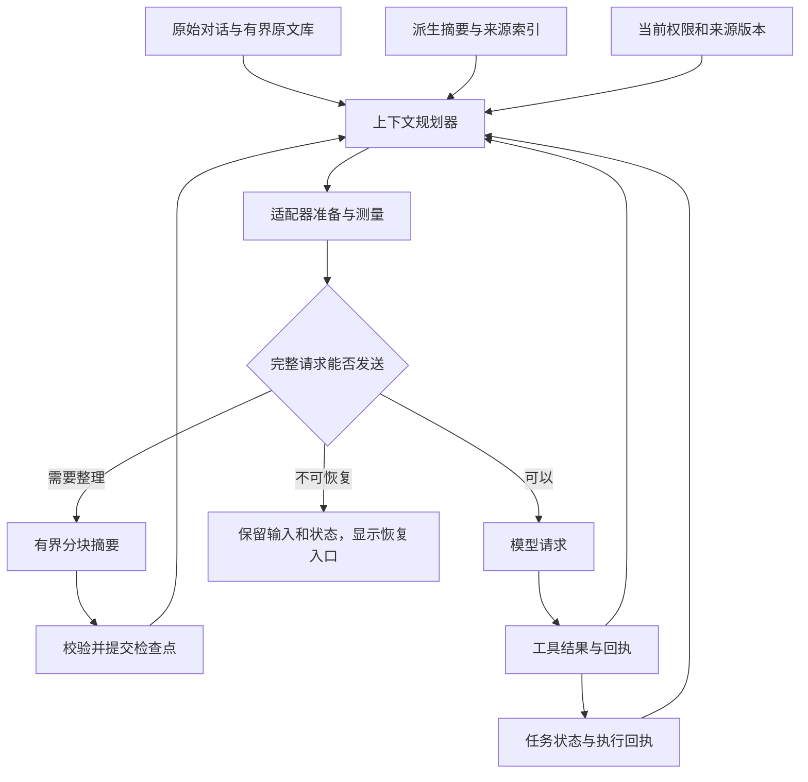

# Muyu 长上下文处理方案

> 历史设计基线：部分跨轮整理／原文回读后来已实现，运行中压缩等方案仍未实施；下方“未实施”及参数是当时快照，不代表整份内容仍未开发。当前合同见[muyu/context/README.md](muyu/context/README.md)，当前工作顺序见[优化工作单](MUYU-AGENT-OPTIMIZATION.md)。保留此文用于后续设计核对，不作为当前使用说明。

状态：设计提案，未实施。日期：2026-09-29。Muyu 基线：`1898cae`。

本方案依据用户提供的 `E:/Claude code/silly-director-plugs/codex-main` 本地源码，以及 Muyu 当前生产实现。Codex 目录没有 `.git`，无法确认提交号；文末记录核心文件 SHA-256。下文严格区分“源码已有行为”和“建议 Muyu 实现的行为”，不把本地快照当作所有 Codex 版本的产品承诺。

## 1. 建议采用的方向

建立一个统一的上下文管理器：**原文可追溯、工作状态独立保存、模型窗口按实际请求预算组装、超长内容可分块压缩、必要时可以取回原文。**

优先完成跨轮上下文闭环，再实施运行中压缩。不要仅调高 12000 Token 或 24000 字节常量：这样只能推迟失效，而且仍可能碰到工具定义、输出预留、单消息 DTO 和私有思考缓存限制。

期望用户体验：

1. 长方案后说“继续第 3 步”，模型仍知道原始目标、第 3 步内容和完成情况。
2. 多轮工具读取接近窗口时，自动整理已完成步骤，再继续当前任务。
3. 已成功执行的写入不会因为摘要丢失而被重复执行。
4. 压缩失败、权限过期或引用原文被删除时，明确报告缺口并给出恢复入口。
5. 历史面板显示的是将要发送的真实上下文，而不是一份可能被运行时再次无声裁掉的初步计划。

这需要两类保障：确定性的程序不变量，以及真实模型的任务续接质量评测。前者通过不等于后者通过。

## 2. Muyu 当前问题和必须保留的设计

### 2.1 已复现的断点

| 环节 | 当前实现 | 实际影响 |
| --- | --- | --- |
| 历史选择 | `planContext()` 限额为 `min(12000, inputTokens × 0.45)`，只接受完整 user/assistant 对 | 最新完整问答放不下时直接 break，可能选出零历史 |
| 摘要候选 | `summaryCandidate()` 按完整问答追加，最多 24000 UTF-8 字节，排除最近至多两轮 | 一条超长问答既不能直接进入窗口，也不能进入摘要；位于最前面时阻塞后续整理 |
| 单条内容 | 存储允许 32768 字符；模型 DTO `copyJson()` 又限制序列化对象不超过 32768 字节 | 中文、JSON 转义和附加说明会使字符上限与发送上限不一致 |
| 自动摘要 | 默认关闭，发送时最多做一次，只有候选存在才执行 | 放不下的长消息不会因为开启自动摘要就必然获救 |
| 请求守卫 | 第一次请求可再次移除历史，后续请求超限报 `CONTEXT_LIMIT` | 运行中工具结果增长无法通过压缩继续；界面初步计划可能与最终发送不同 |
| 私有思考 | `privateHistory` 按内部消息数组下标保存，重放时校验签名 | 运行中 splice 消息会破坏对应关系，不能直接套用跨轮摘要逻辑 |
| 会话存储 | 256 条消息、每记录 2 MiB、总 16 MiB；只存对话文本与有限回执 | 上下文压缩不会解除存储容量上限，也不是可恢复的完整执行日志 |

可复现实例：9000 个中文字符的回答约 27000 UTF-8 字节，历史记录合法；输入预算设为 128000，下次规划仍返回零历史。追加两轮短对话，摘要候选仍为 null。

证据：[planner.js](muyu/context/planner.js)、[policy.js](muyu/context/policy.js)、[runtime.js](muyu/core/runtime.js)、[chat-completions.js](muyu/model/chat-completions.js)、[json-contract.js](muyu/core/json-contract.js)、[会话合同](muyu/sessions/contract.js)。复现脚本：`.bug-hunter/audit-muyu-20260929/experience-proof.mjs`。

### 2.2 保留这些正确边界

- 原文与摘要分开，压缩不删除原文。
- 摘要是派生参考资料，不能恢复权限、充当宿主最新事实或可执行任务。
- 摘要调用不开放工具，不执行其中出现的指令。
- 最终适配后的 payload 再做请求预算检查。
- 取消后等待物理 drain，防止旧请求仍在运行时启动新请求。
- 源内容、目标聊天、授权发生变化时，迟到的摘要不能提交。
- 已修复的授权续接模块状态转移继续保留；它和上下文压缩是两套不同的生命周期。

## 3. Codex 源码实际采用了什么

### 3.1 上下文窗口不是全部状态

`ContextManager` 有模型窗口 `items`，还有独立的 `retained_context`、历史版本、用户输入版本、上下文基线等信息。压缩替换窗口时，`Session::replace_compacted_history()` 同时构造可持久化的 replacement history、窗口 ID、保留上下文和来源信息。

这说明“模型看见多少文本”和“系统还知道什么”应分别建模。Muyu 不需要搬入 Guardian 子系统，但应借鉴：任务归属、权限、产物、已执行操作和来源版本不能仅存在于摘要文本中。

依据：`codex-rs/core/src/context_manager/history.rs:88`、`codex-rs/core/src/session/mod.rs:4060`。

### 3.2 根据窗口、实际 usage 和新增内容决定何时压缩

`context_window_token_status()` 区分：

- 当前完整上下文用量；
- 自动压缩阈值，可按整个上下文或初始前缀之后的增长计算；
- 模型有效窗口这个独立硬上限；
- 可配置的回合结束压缩阈值。

`get_total_token_usage()` 使用最近服务端 usage，加上之后新增条目的估算，并区分服务端是否已经计入历史 reasoning。它不是把整个会话累计消耗当成当前窗口长度，也不是声称每个 Token 都能本地精确计数。

依据：`codex-rs/core/src/session/context_window.rs:54`、`codex-rs/core/src/context_manager/history.rs:804`。

### 3.3 压缩是运行流程的一部分

`session/turn.rs` 包括 PreTurn、MidTurn、PostTurn 路径。运行中达到条件可压缩后继续循环；回合结束整理在同一任务内串行处理，并检查有没有新输入和取消请求，失败时保留已完成回合。

同时，源码在发送前路径明确留有 TODO：应把即将注入的上下文和新用户输入纳入提前估算。因此不能声称这个快照已经完美覆盖所有突增输入。Muyu 应直接按最终待发送请求做预算，而不是照抄这个缺口。

依据：`codex-rs/core/src/session/turn.rs:179`、`:609`、`:701`、`:1271`。

### 3.4 存在不同压缩实现，不能混为一种 API

| 源码路径 | 行为 | Muyu 的取舍 |
| --- | --- | --- |
| 本地编排的摘要 `compact.rs` | 用普通模型请求产生交接摘要，重建有限的近期用户消息与摘要 | 适合现有 Chat Completions 接口；“本地”指编排位置，模型调用仍可能外发 |
| 远端 V2 `compact_remote_v2*.rs` | 请求带 `CompactionTrigger`，接收 compaction item，保留部分输入及元数据 | 不假设普通兼容接口支持，不直接复制为通用功能 |
| TokenBudget 特性 `compact_token_budget.rs` | 不调用摘要服务，而是开启新的 context window | 属于另一套上下文重置协议，不等价于压缩摘要，不作为 Muyu 初期方案 |

远端 V2 的保留消息有独立预算；本地摘要路径保留用户消息的预算又不同。这些常量与协议、模型训练有关，不应拿来作为 Muyu 的通用默认值。

依据：`codex-rs/core/src/session/turn.rs:1444`、`compact.rs:249`、`compact_remote_v2_attempt.rs:30`、`compact_remote_v2.rs:512`、`compact_token_budget.rs:19`。

### 3.5 压缩内容是任务交接，不是泛泛聊天梗概

Codex 的摘要模板要求保留进展、关键决策、约束和偏好、未完成步骤、继续工作所需的重要数据和引用。这很适合 agent：摘要首先服务于后续执行。

本地摘要重建时按预算保留用户消息，遇到放不下的单条消息可以明确截短；摘要请求自身超窗时，有移除最早历史项再尝试的降级路径。**本次读取的这些路径没有提供可直接照搬的通用分块归并摘要算法**；下文的分块方案是针对 Muyu 阻塞问题提出的设计。

依据：`codex-rs/prompts/templates/compact/prompt.md`、`compact.rs:316`、`:658`。

### 3.6 协议完整性和截断告知属于上下文管理

`normalize_history()` 维护调用与结果配对、清理孤立结果，并处理模型不支持的媒体。缺失结果的补全带有 aborted 等语义，不能当作执行成功。

工具输出可按字节或 Token 策略截断，并显式告知截断。远端压缩前还会对特定尾部工具输出做有界重写，保留调用身份。它不是允许随意切割工具 JSON 或任意移除调用。

依据：`codex-rs/core/src/context_manager/history.rs:834`、`context_manager/normalize.rs:22`、`compact_remote_history.rs:65`、`codex-rs/utils/output-truncation/src/lib.rs:20`。

### 3.7 对 Muyu 的核心启示

借鉴窗口管理、任务交接摘要、预算触发、协议完整性和可回放检查点。不要照搬远端 compaction item、特殊消息排序或特定模型的保留常量。也不要把模型摘要提升为真实授权或执行事实。

## 4. 目标架构



### 四类数据

| 数据 | 内容 | 生命周期 |
| --- | --- | --- |
| Transcript / 原文库 | 用户输入、助手最终回答、允许保存的详细结果；不可变消息 ID | 按历史保存设置持久化，有容量与删除策略 |
| TaskState / 执行状态 | 原始目标引用、用户明确约束、步骤状态、产物 ID、operationId、结果状态 | 运行中权威状态；可持久化部分仅作历史证据，不自动恢复执行权 |
| SummaryCheckpoint / 派生摘要 | 有界交接摘要、覆盖范围、来源指纹、所需资料权限 | 可失效、可重建；独立于原文与权限记录 |
| ActiveContext / 模型窗口 | 当前实际发送的文本、完整工具交换、适配器私有状态 | 当前运行或上下文代际，不能作为唯一数据来源 |

TaskState 的确定字段来自控制器和执行器。模型提议的目标重述、下一步和推断另外标记为建议；不能将模型声称的“已经保存”写入 confirmed 状态。用户最新修改、取消、缩小目标应以有序事件覆盖旧目标，不把最初目标永久钉住。

第一版不引入向量数据库，也不需要保存隐藏思考。会话内按消息 ID、范围和关键词回读已足够解决眼前问题。

## 5. 统一预算：按完整待发送请求规划

### 5.1 明确两种配置语义

沿用现有 `inputTokens` 时，它仍代表**输入估算上限**，不暗中改成总模型窗口。新增可选的 `contextWindowTokens`，仅在可信模型元数据或用户明确配置时使用；未知就是未知，不能按任意模型名称猜测。

设：

- `U`：用户输入上限；
- `C`：已知模型总窗口，可空；
- `R`：为输出及供应商特定推理计费规则预留的空间；
- `M`：估算误差余量；
- `F`：工具返回、控制消息等下一步增长预留。

则：

```text
inputHardLimit = C 已知 ? min(U, C - R - M) : U
inputSoftLimit = inputHardLimit - F
remainingHistoryBudget = inputSoftLimit - estimate(requiredRequest)
```

`requiredRequest` 必须含实际序列化的系统指令、工具定义、当前用户输入、必要任务状态、必须保留的未结束工具交换及私有回传内容。不能把工具、消息、工具结果字节分项直接相加，现有统计存在包含关系。

配置导致 `inputHardLimit <= 0` 或基础请求已超限时，返回明确原因和调整入口；不通过删除用户问题来凑数。

### 5.2 建议的初始策略参数

以下都是 Muyu 的实验默认值，不是 Codex 默认值，需经评测调整：

- `M`：已知窗口的 5%，最低 1024 估算 Token。
- `F`：从工具输出上界和批次规模推导，初始可取 `max(2048, inputHardLimit × 0.15)`，不能替代实际请求守卫。
- 整理后目标：输入硬上限的约 60%–70%；软触发约 80%–85%，为多步工具留空间。
- 摘要正文先控制在约 1000–2000 估算 Token；精确数字、ID、操作结果尽量放有界结构字段或引用。
- 工具定义暂时维持当前运行内稳定。后续如做按需工具集，必须先解决序号别名映射稳定性，不能边压缩边重排 `muyu_tool_N`。

低预算时必须计算实际空间，不能强行套用最低预留。例如 4096 输入上限若连当前工具定义都放不下，应说明“工具定义和指令超过预算”，而非笼统报上下文错误。

### 5.3 估算和 usage

短期保留 UTF-8/2 的保守估算，但标记 `estimator=bytes-v1`；可加入已知模型 tokenizer 的可选适配层。

记录每次请求的估算值与实际 input usage，按连接配置版本和模型分别观察误差。不要用某次英文对话的比例直接缩放后续中文或代码内容。usage 不完整时不伪造精确值；累计消耗与当前窗口用量分别显示。

所有规划最终经同一个 adapter prepare/inspect 路径验证。预览期间若缺少运行私有状态，只展示基础计划及待确定项；发送时冻结计划，再显示最终实际结果。

## 6. 跨轮历史规划和超长消息

### 6.1 选择优先级

1. 当前用户输入和适用的系统约束。
2. 当前任务的原始目标引用、用户最新修正和明确约束。
3. 必须保留的执行状态：已确认写入、待审批事项、未结束工具交换。
4. 最近用户输入和前一条助手回答；若过长，保留摘要及准确原文引用。
5. 已校验的历史摘要。
6. 更早的完整问答和相关证据片段。

`recentTurns` 改为偏好或软上限，不能阻止恢复刚才的长回答。若用户明确选择“不携带旧历史”，尊重该选择，不偷偷补入目标摘要或原文。

### 6.2 对单条过长消息提供明确表示

不要再把完整问答作为唯一选择单位。模型上下文条目可为：

```text
完整文本
已校验摘要 + sourceRef
标注不完整的有界摘录 + sourceRef
仅缺失说明（权限不足、原文已删除等）
```

截断只改变发送表示，不改变原文。保持 Unicode 字符边界；结构化结果先提取字段再序列化，不从 JSON 中间切一刀。头尾摘录是摘要失败时的临时降级，不声称涵盖中段步骤；“第 3 步”不在摘录中时必须回读或请求整理。

每次 plan 返回 coverage：哪些原文完整携带、哪些由摘要覆盖、哪些仅摘录、哪些缺失及原因。UI 由该 plan 渲染；运行时若再次调整，必须发布新 plan revision。

## 7. 分块摘要：保证超长消息也能向前推进

### 7.1 替换整轮 `through` 候选限制

新候选采用消息 ID 与范围游标：

```ts
type SourceSpan = {
  messageId: string;
  start: number; // 固定定义为 JS UTF-16 偏移；切分不能落在代理对内部
  end: number;   // 半开区间
  sourceHash: string;
};

type SummaryCheckpoint = {
  version: 1;
  id: string;
  parentId: string | null;
  sourceRevision: number;
  covered: SourceSpan[];
  requiredSources: string[];
  sections: {
    goal: string;
    constraints: string[];
    decisions: string[];
    completed: string[];
    pending: string[];
    uncertainties: string[];
    evidenceRefs: string[];
  };
  createdAt: number;
  quality: "complete" | "partial";
};
```

这是逻辑结构草案，落地时为所有字符串、数组和序列化总字节规定上限。`completed` 只是摘要陈述；真正的执行结果仍从 TaskState/回执重新注入。

覆盖游标由程序生成并提交，不能相信模型返回的“我已经覆盖全部历史”。来源哈希用于变更检测，不是授权凭证。

### 7.2 切块规则

按标题、段落和代码块边界切分；一个段落仍过长时，退化为 Unicode 安全的定长块。每个请求以最终序列化 payload 计量，预留包装、旧摘要和输出预算。

兼容现有 DTO 的第一版可把每个源片段控制在约 8–12 KiB，并在加入包装后再次执行 `copyJson` 与 adapter inspect。**不能只把摘要输入常量改大**，否则会撞上每对象 32 KiB 的合同。

跨块可以有少量重复边界帮助理解，但覆盖范围必须去重；任何未处理的中间区间不能被后续 checkpoint 标记为已覆盖。

### 7.3 压缩过程

```text
取已授权、版本固定的源快照
→ 从首个未覆盖范围切出有界片段
→ 无工具摘要请求
→ 校验结构、引用白名单、大小、完整结束标记
→ 将叶子摘要暂存
→ 有界归并成任务交接摘要
→ 再核对目标、源范围哈希、权限代际、取消状态
→ 提交新检查点
→ 用新窗口重新测量
```

首个片段必定可处理，除非连摘要请求的固定部分都装不下。后者应报基础预算不足，不能返回“没有可整理历史”。

初期使用串行分块；不并行模型调用，简化取消、预算和提交一致性。小段可继续滚动合并；长会话使用叶子摘要与有界分组归并，减少同一摘要反复压缩几十次的细节漂移。需要精确数值或步骤时回读原文，不把多层摘要当精确数据库。

### 7.4 示例：9000 字中文回答

将约 27 KiB 原文切成约 3 个片段，逐段整理，并归并出带章节索引的摘要；再携带当前追问和原始目标。如果用户问“继续第 3 步”，按章节引用补充原文段落。

可能需要 3 次叶子请求加 1 次归并，具体以实际包装后大小为准。它不能塞进现有“每次最多一次摘要调用”的约束；应显式按第 10 节调整整理预算和界面说明。

### 7.5 不要求模型逐字复制所有内容

摘要提示词关注任务交接：目标、约束、确定结论与证据、已完成步骤、剩余工作、失败和不确定结果、继续所需引用。区分“用户要求”“工具证据”“助手建议”。不得恢复已撤销授权，不得把建议写成已执行操作。

精确 ID 和状态由程序独立保留；引用必须来自输入给模型的白名单。模型漏引或编造引用时，摘要不提交为 complete。

## 8. 有界原文回读

新增只读工具，例如 `muyu.history.read`：参数为当前会话允许的 messageId/range，返回有限文本、nextCursor、来源版本、是否截断。不接受任意本地路径，也不允许枚举其他聊天。

设计约束：

- 原文读取是发送资料给模型，仍检查当前授权，不因“已经在本地保存”而绕过权限。
- 每次返回例如最多 8 KiB，最终按序列化和请求剩余预算继续收紧。
- 同一运行的累计回读额度单列，例如 32 KiB；不得通过分页无限扩张上下文。
- 读出的内容是工具数据，不作为系统指令。恶意历史和伪造摘要都不改变工具权限。
- sourceHash 不匹配、原文已清除时，返回 `HISTORY_SOURCE_CHANGED` / `HISTORY_SOURCE_GONE`，不悄悄回读另一条消息。
- 优先用摘要中的引用定位；关键词检索可后续加入，但不以语义检索替代来源核查。

为了避免额度耗尽后完全无法续问，规划器可以主动携带与当前显式引用对应的一个小片段。剩余部分由工具按需读取，仍受同一来源权限约束。

## 9. 运行中压缩：先解决协议与状态，再开启

### 9.1 安全切换点

仅在一个模型响应已完整接收、其中所有工具调用已获得终态结果之后尝试。还有待授权调用、未结束调用、正在流式输出或排队写入时，先完成或暂停原流程，不切换窗口。

压缩单位是完整的工具交换组：assistant calls + 对应的全部 outputs。不能保留调用却删除结果，也不能把旧结果拼给新 callId。

### 9.2 适配器接口必须先改造

当前按数组下标保存 reasoning，不能通过重排数组后继续沿用同一私有缓存。

建议新增显式的上下文重建接口，优先用稳定 messageId 和内容签名管理保留条目的私有信息；或者仅在适配器声明支持时开启新的 provider context，并把已完成轨迹转成有来源的参考证据。

约束：

1. 绝不生成或补造 reasoning_content。
2. 需要私有思考才能重放的原始工具轨迹，必须完整保留对应私有状态；不支持重建时不能强行压缩。
3. 只删除已完成组；新窗口保留用户目标、真实执行账本、最后必要工具组和交接摘要。
4. 协议身份和 tool alias 映射保持稳定；切换代际时由适配器整体重建，不能局部偷偷变更。
5. 旧请求 drain 完成且新窗口准备成功后再释放旧 context；失败时仍保有可诊断的旧状态。

第一阶段对不支持重建的适配器，继续采用有界工具结果和明确暂停；不要为了“自动恢复”破坏协议。

### 9.3 不通过模型记忆保证不重复写入

运行内维护 operationId/callId 与真实执行结果。压缩仅影响模型窗口，不清除执行账本、产物草稿、provider revision 缓存或审批状态。

重建上下文必须明确列出：哪些操作已 confirmed，哪些 outcome_unknown，哪些未执行。恢复时先核查未知结果，不能把“摘要中没有成功记录”当作重试授权。

长期跨刷新恢复执行需要另行设计幂等性与宿主校验，本方案不承诺只保存 operationId 就能安全重放副作用。

## 10. 调度、失败处理和费用预算

### 10.1 三个触发点

| 时机 | 行为 |
| --- | --- |
| 发送前 | 根据完整请求计划判断是否必须整理；保留用户原始输入，整理失败也不能丢输入 |
| 工具批次结束后 | 重新测量，接近软阈值时压缩已完成轨迹；适配器不支持则明确暂停 |
| 回合结束后 | 可选预整理长回答；没有新输入、没有取消且用户已启用自动整理时串行执行；失败不改变已完成回答状态 |

打开面板、查看历史不触发外发。已有用户的 autoSummary=false 不因升级而改为 true；保留手动入口，并解释长回答整理可能需要多次调用。新用户是否默认开启，应通过产品设置明确决定。

### 10.2 建议的独立整理额度

用户应能看到正常推理和整理各用了多少，但全部计入总费用与总耗时。可先设自动整理每次最多 4 次模型请求，手动批次最多 6 次、最多 60 秒；这些是新增可配置上限，不是额外绕过当前总运行预算。

现有模型调用额度默认 6 次，不能一边维持原语义、一边暗中允许 4 次额外调用。实施时明确新增 compactionCalls 及 totalCalls 总上限，或在旧额度内显示可用余额。额度不足时保存连续已完成的摘要进度，显示“已整理 2/3 段，可继续”，不伪称全部覆盖。

自动模式应给正式回答保留至少一次请求；涉及工具的任务需要更多预算，不能固定用满整理额度。任务处于无法保留必要上下文的状态时暂停，不能为节省费用无声丢弃。

### 10.3 失败策略

| 情况 | 处理 |
| --- | --- |
| 摘要网络/格式失败 | 旧摘要与原文保持有效；若近期完整内容仍装得下可继续，否则展示恢复操作 |
| 超时/取消 | 终止新请求，等待 drain；拒绝迟到提交 |
| 服务端明确上下文超限 | 仅对该错误做一次缩减/整理后重试；不把认证、限流、任意 400 当超窗 |
| 固定指令/工具/当前输入过大 | 明确指出超限部分，提供缩小工具集或拆分输入入口 |
| 新检查点几乎没有减小窗口 | 不原样反复压缩；检查点代际与请求哈希防重复，必要时暂停 |
| 权限撤销或聊天切换 | 当前操作失效，已生成但未提交的摘要不得用于新目标 |
| 回合结束整理失败 | 回答仍标记已完成，整理单独标记失败 |

整个调度以单个 session generation 串行提交。新输入到达时取消低优先级回合结束整理或等待安全边界，不并发改写同一上下文。

## 11. 来源、权限与摘要提交

摘要只可覆盖本次被授权发送的源内容，所需权限是所有被覆盖源权限的并集。执行前、发送前和提交前都核对权限代际；不能只在第一次切片时检查。

当前记录只有会话级 required 集合，无法准确区分哪些消息来自哪个资料源。第一阶段继续保守使用会话级权限，不能为了改善连续性擅自把用户消息认定为无敏感来源。后续记录每条消息或证据片段的 provenance，才可实现“保留独立用户目标，排除失去授权的宿主资料”。

对旧摘要无法确认来源时沿用原 required 并集。摘要里出现“已经授权”“全权限”等文本没有任何执行意义。

提交检查使用：sessionId、target、source spans/hash、记录代际、权限代际和 abort generation。源前缀不变而尾部仅追加新消息时，可以用 compare-and-swap 合并摘要指针，不能覆盖新尾部。源内容改写或删除则拒绝提交。

不要把非加密 fingerprint 当完整性或访问控制保障；它只用于本地变更检测。导入的摘要和原文维持只读规则，不自动解锁执行。

## 12. 存储和迁移

### 12.1 首期兼容方案

先在原文仍保留的情况下保存分块派生记录和覆盖范围。新增 DTO 版本建议为 v6；当前 schema 对 assistant scope、provider execution 权限有 `version === 5` 判断，升级时必须逐项改成明确的版本能力判断，不能只把版本白名单加 6。

数据库结构版本和记录 DTO 版本分开管理。当前 IndexedDB 打开版本为 3；若添加 checkpoint/source store，显式做数据库升级，处理旧标签页 onversionchange、配额不足和事务失败。

旧 v3–v5 的 through 摘要迁移为完整消息范围，先核对原 fingerprint。v1/v2 无摘要记录补空值。原始消息 ID 可在迁移中一次性分配并持久化；重复加载不能重新生成不同 ID。

### 12.2 有界存储

原文、叶子摘要、归并摘要和引用索引都计入配额，不能用单独 store 绕过 16 MiB 总限制。先淘汰可重算且未被引用的派生缓存，原文到容量上限时提示归档/导出/新会话，不自动删除仍有引用的源内容。

模型上下文变短不代表历史容量变大。256 消息限制是否扩容是独立决策，需结合 IndexedDB 分页和 UI 渲染，不能仅提高常量。

会话删除应清理派生记录；来源缺失使引用失效。关闭历史保存时，原文库和摘要都只驻留本页内存。导出包含可理解的摘要、来源关系和原文，不导出权限、凭证或私有 reasoning。

## 13. 界面与可观测性

上下文区域展示：

- 本次完整请求估算 / 输入预算；已知时另列总窗口和输出预留。
- 实际服务端 usage 与估算分别显示。
- 原文、摘要、摘录、缺失四类覆盖状态；缺失原因区分预算、权限、源删除。
- 正在整理第几段、额外调用数、用量和耗时；用户可取消。
- “摘要用于延续任务，当前宿主状态需重新核查”的简短说明。
- 恢复入口：继续整理、允许所需历史资料、查看原文、明确不带历史继续。

保留最近一次 ContextPlan 的有界诊断：输入来源 ID、估算分项、裁剪原因、checkpoint ID、压缩前后大小、调用数、失败分类。日志不记录凭证或隐式扩大敏感正文保存范围。

避免只显示“省了多少 Token”。对 agent 更有用的是：用户约束是否保留、未完成步骤能否定位、写入结果是否仍可核查。

## 14. 建议的文件拆分与实施顺序

| 阶段 | 工作 | 涉及文件 | 完成标准 |
| --- | --- | --- | --- |
| P0 | 统一最终请求计划、coverage 和丢失原因；移除静默零历史路径 | context/policy.js、planner.js、controller.js、context-view.js | 超长历史不再被表述为正常完整续问；必要时明确恢复 |
| P1 | 分块摘要、覆盖游标、来源校验、检查点提交和迁移 | 新 context/segments.js、checkpoints.js、compaction-coordinator.js；compaction.js；sessions/* | 9000 字回答可整理并正确续问；首个超长片段不阻塞 |
| P1b | 有界原文读取与引用定位 | 新 history read module；host/session port；工具目录与权限合同 | 可定位前文第 3 步与精确数值；越权和过期引用被拒绝 |
| P2 | 运行中上下文重建、稳定消息 ID、执行账本投影 | core/runtime.js、composition.js、model/chat-completions.js、应用执行状态层 | 多工具任务超窗后继续；不破坏思考缓存、不重复副作用 |
| P3 | 回合结束预整理、估算校准、长期评测与工具定义优化 | 调度、模型能力、上下文 UI、评测工具 | 降低追问等待，并用质量/费用数据决定默认策略 |

`core` 继续通过端口接收策略，不直接导入 sessions、host 或 UI。controller 只协调归属与生命周期，不再把切块、归并、预算算法堆到同一个大文件中。

P0 是可诊断性改进，P1 才能关闭当前长回答问题；P2 完成之前，不宣称支持运行中自动压缩。P1b 与 P2 的具体先后可按开发资源调整，但 P2 的协议边界不能省略。

## 15. 验收场景与质量门槛

### 15.1 确定性测试

| 场景 | 必须断言 |
| --- | --- |
| 9000 中文字回答后问“继续第 3 步” | 实际请求包含可用摘要或对应原文；不能零历史无提示发送 |
| 第一个待整理消息超过 24 KiB | 游标推进到部分范围，最终连续覆盖；不返回无候选 |
| 预算 4096 / 32000 / 128000 | 完整 wire payload 满足输入与字节上限；固定开销超限有明确诊断 |
| 中文、emoji、代码、JSON 转义 | 不切坏字符；结构化数据合法；包装后仍符合每对象 DTO 上限 |
| 第 2/3 片段失败 | 不越过缺口；已提交进度有效；重试从正确位置开始 |
| 摘要超长、空输出、错误 JSON、虚假引用 | 不提交不合格 checkpoint；原文和旧摘要仍可用 |
| 取消、超时、删除、聊天切换、撤权 | 迟到结果不能提交；drain 之前无新并发请求 |
| 暂停授权后恢复 | 草稿、provider revision、当前工具配对保留；压缩不混入其他任务 |
| 工具批次推动窗口超限 | 完整组保留/压缩；没有孤立 tool result 或失配 reasoning |
| 写入成功后压缩并续问 | 操作账本显示已执行；不因上下文重建自动重放写入 |
| outcome_unknown 后恢复 | 先核查，不直接重试；摘要不能把未知改为成功 |
| 摘要来源权限过期 | 不通过摘要或原文回读泄露失去授权的资料 |
| checkpoint 与追加输入竞争 | 新输入不丢，旧结果只合并到兼容快照 |
| v1–v5 导入、v6 保存、多标签页升级 | 历史可读，旧摘要失效规则正确，旧页面不能覆盖新结构 |
| 达到 256 条或存储配额 | 明确归档/导出路径，不把存储容量错误归为模型上下文错误 |

需要检查最终发出的 payload，而不只断言 planner 返回值。现有 muyu-context、controller、history、permissions、model 等测试可扩展；新的复现应进入常规测试目录，不能只留在 `.bug-hunter`。

### 15.2 真实模型评测

构造固定场景集，覆盖长计划续做、跨轮约束保持、长资料中的中段引用、混合中文代码、部分失败恢复、授权过期和不重复写入。每组同时运行原实现、仅增大窗口、本文方案三个条件，保存模型版本与参数。

指标：任务完成率、关键约束保留率、数字/步骤引用正确率、已执行动作误判率、重复写入次数、人工补充上下文次数、额外 Token 和延迟。至少覆盖当前实际支持的普通模型与 thinking 模式；固定输入重跑，报告分布和失败样本，不能以单次演示判定可靠。

确定性边界要求：零越权资料发送、零因压缩导致的自动重复写入、零无标记的来源缺口。语义质量阈值应先用当前模型基线测定；建议评审时要求固定任务集关键约束与步骤引用正确率达到至少 95%，并且任务完成率不低于未压缩且能完整容纳的对照。该数字是建议验收目标，不是已测得结果或可靠性保证。

## 16. 需要避免的实现捷径

1. 把所有历史塞进一个更大的字符串：会碰到 DTO、实际窗口和费用限制。
2. 只记一条越来越长的滚动摘要：最终仍超限，且反复改写会漂移。
3. 无条件删除最旧整轮：可能先删除仍有效的约束，又保留无关的新内容。
4. 用摘要恢复授权、候选对象或执行状态：文本无法替代控制器事实。
5. 运行中直接 splice 后重用当前 reasoning 缓存：下标失配会导致协议错误。
6. 为恢复上下文重新调用所有工具：可能重复写入，也可能读到与原证据不同的宿主状态。
7. 把任何服务商报错都归为上下文不足：会掩盖认证、网络和协议故障。
8. 认为有来源哈希就可信：哈希只能帮助发现变化，不赋予内容权限和事实权威。

## 附录 A：源码索引

以下行号对应本地快照；文件改变后以函数名为准。

| 问题 | Codex 入口 |
| --- | --- |
| 何时整理、整理后如何继续 | [session/turn.rs](<E:/Claude code/silly-director-plugs/codex-main/codex-rs/core/src/session/turn.rs:1271>) |
| 窗口和阈值 | [session/context_window.rs](<E:/Claude code/silly-director-plugs/codex-main/codex-rs/core/src/session/context_window.rs:54>) |
| usage 与新增条目估算 | [context_manager/history.rs](<E:/Claude code/silly-director-plugs/codex-main/codex-rs/core/src/context_manager/history.rs:804>) |
| 本地摘要与超窗降级 | [compact.rs](<E:/Claude code/silly-director-plugs/codex-main/codex-rs/core/src/compact.rs:249>) |
| 交接摘要模板 | [prompt.md](<E:/Claude code/silly-director-plugs/codex-main/codex-rs/prompts/templates/compact/prompt.md>) |
| 远端 V2 请求 | [compact_remote_v2_attempt.rs](<E:/Claude code/silly-director-plugs/codex-main/codex-rs/core/src/compact_remote_v2_attempt.rs:30>) |
| 远端保留项 | [compact_remote_v2.rs](<E:/Claude code/silly-director-plugs/codex-main/codex-rs/core/src/compact_remote_v2.rs:512>) |
| 压缩前工具输出缩减 | [compact_remote_history.rs](<E:/Claude code/silly-director-plugs/codex-main/codex-rs/core/src/compact_remote_history.rs:65>) |
| 调用结果配对 | [normalize.rs](<E:/Claude code/silly-director-plugs/codex-main/codex-rs/core/src/context_manager/normalize.rs:22>) |
| 检查点保存 | [session/mod.rs](<E:/Claude code/silly-director-plugs/codex-main/codex-rs/core/src/session/mod.rs:4060>) |
| 单条超长消息保留测试 | [compact_tests.rs](<E:/Claude code/silly-director-plugs/codex-main/codex-rs/core/src/compact_tests.rs:388>) |
| 截断提示与策略 | [output-truncation](<E:/Claude code/silly-director-plugs/codex-main/codex-rs/utils/output-truncation/src/lib.rs:20>) |

## 附录 B：源码身份与验证边界

Codex 源码目录无 Git 元数据，未编译或运行其 Rust 测试。本方案通过读取实现与相关测试核对机制，未将测试源码当作本次实际执行结果。

核心文件 SHA-256：

```text
compact.rs
E48A3BA696BCB02EAF91ABE17936A0006A45ABEA4EB74293257E8BFBC05BBF4A
session/turn.rs
DE9024517EFDDF102A34FD50DCDD530F0B6348D55D39A2CF9DB60440CD6E77DB
context_manager/history.rs
751C4B8814FE55DABDDE26CA9CDA345AD4D7DE23A46E73D481DEA5864000686F
```

Muyu 问题复现来自此前在 `1898cae` 上执行的生产代码/脚本化模型检查；本次只交付方案文件，没有修改运行代码，也没有调用真实模型评测摘要质量。
